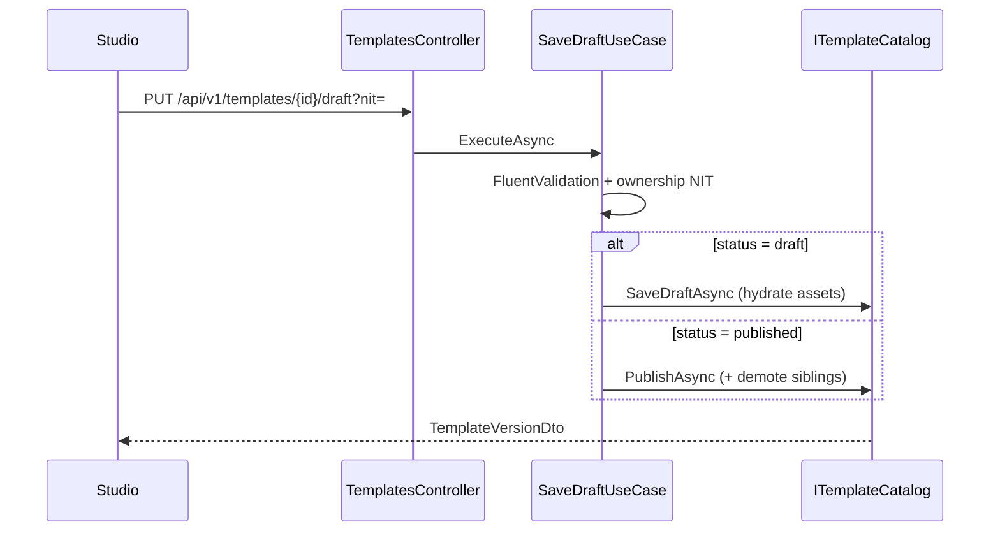
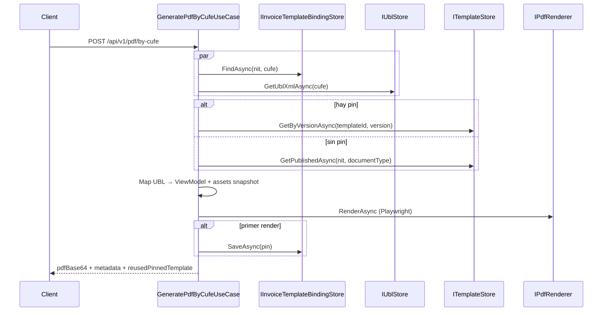

# Btw.TemplatePdf

API .NET 10 para **catalogar plantillas HTML/CSS versionadas** (studio) y **generar PDF de facturas electrónicas por CUFE**, renderizando con Chromium (Playwright) a partir del UBL obtenido de FE/DIAN.

Este documento describe la arquitectura y el comportamiento del sistema para revisión y calificación del proyecto.

---

## 1. Contexto y alcance

| Incluye | No incluye |
|---|---|
| CRUD de plantillas por NIT + tipo de documento | Login propio / validación de JWT |
| Versionado draft → published → used | Generación de PDF “por id de plantilla” (solo por CUFE) |
| Publicación exclusiva (una viva por NIT × tipo) | Event bus, outbox, CQRS con MediatR |
| PDF por CUFE con pin de versión | Multi-tenancy por claims del token |
| Biblioteca de brand assets (logos) | UI del studio (repo `btw-template-studio`) |

**Consumidor principal:** `btw-template-studio` (Vite).  
**Upstream de UBL:** FE `GetDocumentFromDian` (mismo contrato que ARService / FeDocumentClient).

### Repositorio canónico y rama compartida

Trabajamos **todos sobre la misma rama `main`** en un solo remoto por proyecto (no usar forks desincronizados):

| Proyecto | Remoto canónico |
|---|---|
| Backend PDF | `https://github.com/AntonioDiaz23/btw-template-pdf.git` |
| Studio | `https://github.com/ing3am/btw-template-studio.git` |

```bash
# Backend — origin debe ser AntonioDiaz23 (no el fork ing3am/btw-template-pdf)
git remote set-url origin https://github.com/AntonioDiaz23/btw-template-pdf.git
git fetch origin
git checkout main
git pull origin main

# Studio
git remote set-url origin https://github.com/ing3am/btw-template-studio.git
git fetch origin
git checkout main
git pull origin main
```

`dev` en ambos repos canónicos se mantiene alineada con `main`. El fork `ing3am/btw-template-pdf` **no** es la fuente de verdad; conviene dejar de usarlo o sincronizarlo / archivarlo para evitar confusiones.

---

## 2. Decisiones de arquitectura (ADR)

### ADR-001 — Clean Architecture por capas

**Decisión:** Separar el sistema en Domain → Application → Infrastructure → Api, con dependencias **solo hacia adentro**.

**Motivo:** Aislar reglas de negocio (versionado, pin CUFE, publicación exclusiva) de detalles técnicos (EF Core, Playwright, HTTP FE). Facilita pruebas de use cases con dobles de puertos y sustituir adaptadores sin tocar el núcleo.

**Consecuencia:** Controllers delgados; lógica en use cases; persistencia y PDF detrás de interfaces.

```
Api ──► Application ──► Domain
 │            ▲
 └────────────┴── Infrastructure (adapters)
```

| Proyecto | Responsabilidad |
|---|---|
| `Btw.TemplatePdf.Domain` | Modelos (`InvoiceViewModel`, …) y **puertos del pipeline PDF** |
| `Btw.TemplatePdf.Application` | Use cases, FluentValidation, puertos de catálogo / brand assets |
| `Btw.TemplatePdf.Infrastructure` | Postgres, Playwright, cliente FE/DIAN, mapeo UBL |
| `Btw.TemplatePdf.Api` | Composition root, HTTP, Swagger, OTel, middleware de errores |

---

### ADR-002 — Use cases explícitos (sin MediatR)

**Decisión:** Un caso de uso = una clase con `ExecuteAsync`, inyectada en el controller.

**Motivo:** Flujo legible para revisores; menos indirection que un bus de comandos en un dominio acotado.

**Ejemplos:** `SaveDraftUseCase`, `GeneratePdfByCufeUseCase`, `UploadBrandAssetUseCase`.

---

### ADR-003 — Ports & adapters

**Decisión:** El Domain define el contrato del pipeline PDF; Application define el del catálogo studio.

Puertos Domain (`Domain/Abstractions/Ports.cs`):

- `ITemplateStore` — plantilla publicada viva / versión pineada  
- `IInvoiceTemplateBindingStore` — pin CUFE → (templateId, version)  
- `IUblStore` — XML UBL por CUFE  
- `IUblToViewModelMapper` — UBL → `InvoiceViewModel`  
- `IAssetStore` — bytes de imágenes embebidas  
- `IPdfRenderer` / `IPdfMetadataWriter` — HTML→PDF y metadata  

Puertos Application: `ITemplateCatalog`, `IBrandAssetStore`.

Infrastructure implementa esos puertos (`PostgresTemplateCatalog`, `PlaywrightPdfRenderer`, `FeDianUblStore`, …).

---

### ADR-004 — Persistencia Postgres + bootstrap en arranque

**Decisión:** EF Core + Npgsql; `DatabaseInitializer` asegura esquema al iniciar (`EnsureCreated` + SQL incremental para bindings / columnas).

**Motivo:** Despliegue simple en demos y contenedores sin pipeline de migraciones complejo en esta fase.

**Trade-off:** Evolución de esquema más manual que migraciones EF formales; aceptable mientras el modelo sea estable.

---

### ADR-005 — PDF solo por CUFE + pin de versión

**Decisión:** Único endpoint de generación: `POST /api/v1/pdf/by-cufe`. La primera generación exitosa **fija** plantilla y número de versión en `invoice_template_bindings`. Reimpresiones del mismo CUFE reutilizan esa versión aunque la plantilla viva haya cambiado o se haya archivado.

**Motivo:** Cumplir trazabilidad documental: el PDF de una factura ya emitida no debe mutar si el studio publica otra plantilla después.

---

### ADR-006 — Publicación exclusiva por NIT × documentType

**Decisión:** Al publicar (o hacer rollback a publicada), las versiones `published` de **otras** plantillas del mismo NIT y tipo pasan a `used`. Solo una plantilla genera PDFs “nuevos” (sin pin previo).

**Motivo:** Evitar ambigüedad en `GetPublishedAsync` y alinear el catálogo con la regla de negocio “una plantilla activa por tipo de documento”.

---

### ADR-007 — Auth forward-only

**Decisión:** No hay login en TemplatePdf. El studio envía el JWT de FE; middleware copia el Bearer a un accessor scoped y el cliente FE lo reenvía a `GetDocumentFromDian`.

**Motivo:** Reutilizar la sesión del ecosistema FE sin duplicar identidad. El alcance multi-empresa se modela por **NIT en query/body**, no por claims validados aquí.

**Implicación de seguridad:** La API confía en la red / gateway y en el caller; endurecimiento (validar JWT, autorizar NIT) queda fuera del alcance actual.

---

### ADR-008 — Playwright con pool y warm-up

**Decisión:** Chromium vía Microsoft Playwright; `PlaywrightBrowserPool` (singleton) + `PlaywrightWarmupHostedService` al arrancar. Una página nueva por render; el browser se reinicia si Playwright falla.

**Motivo:** HTML/CSS de factura con fidelidad de impresión real; reducir cold-start en el primer PDF.

---

### ADR-009 — Brand assets con snapshot inmutable

**Decisión:** Biblioteca por NIT (`brand_assets`). Al guardar borrador, `BrandAssetHydrator` embebe `dataUrl` en `AssetsJson` de la versión. El render lee el snapshot, no la tabla viva.

**Motivo:** Borrar o reemplazar un logo en la biblioteca no rompe PDFs pineados ni versiones históricas.

---

## 3. Modelo de plantillas (ciclo de vida)

### Estados de versión

| Estado | Significado |
|---|---|
| `draft` | Borrador editable en el tip |
| `published` | Versión viva para PDFs nuevos (sin pin) |
| `used` | Ya publicada antes; historial / elegible a rollback; sirve a pines CUFE |

### Estados de plantilla (fila)

| Estado | Significado |
|---|---|
| `draft` | Nunca publicada (o solo borradores) |
| `published` | Tiene una versión viva |
| `used` | Tuvo publicación; otra plantilla del mismo NIT×tipo tomó el lugar |
| `archived` | Soft-delete: oculta del listado y de la lookup viva; versiones siguen para pines |

### Reglas operativas

1. Guardar borrador sobre tip `published`/`used` crea `versionNumber + 1` en `draft` (la publicada viva no cambia hasta publicar).  
2. Publicar: tip → `published`; versiones publicadas previas de **esa** plantilla → `used`; luego democión de hermanas (ADR-006).  
3. No se puede publicar un tip `used`: primero hay que crear borrador.  
4. **Archivar** demota la publicada viva a `used` y marca la plantilla `archived`.  
5. **Eliminar (hard)** solo si nunca hubo published/used y no hay bindings; si no → `409 conflict` (mensaje de archivar).  
6. **Rollback** re-publica una versión `used` sin crear número nuevo; descarta borrador tip abierto; también aplica exclusividad.

---

## 4. Flujos principales

### 4.1 Guardar / publicar plantilla



### 4.2 Generar PDF por CUFE



**Resumen de elección de plantilla**

1. Si existe binding → versión fija.  
2. Si no → única publicada no archivada para ese NIT + `documentType`.  
3. Si no hay publicada → error de negocio (mensaje en español).

### 4.3 Brand assets

`POST /api/v1/brand-assets` (multipart) → límites: imagen, ≤ 1.5 MB, ≤ 5 por NIT.  
Uso en plantilla: el studio referencia ids; al guardar draft se materializan en el snapshot de la versión.

---

## 5. Superficie HTTP (`/api/v1`)

| Recurso | Endpoints relevantes |
|---|---|
| **Templates** | `GET/POST /templates`, `GET /templates/{id}`, `PUT .../draft`, `DELETE .../draft`, `POST .../archive`, `DELETE .../{id}`, `POST .../versions/{n}/rollback` |
| **PDF** | `POST /pdf/by-cufe`, `GET /pdf/bindings/by-cufe` |
| **UBL** | `GET /ubl/by-cufe` |
| **Brand assets** | `GET/POST /brand-assets`, `GET .../{id}/content`, `DELETE .../{id}` |

Errores: middleware → JSON `{ code, message, traceId }`. Validación con FluentValidation.

Contrato PDF detallado: [`docs/pdf-api-contract.md`](docs/pdf-api-contract.md).

---

## 6. Stack y composición

| Pieza | Elección |
|---|---|
| Runtime | .NET 10 |
| API | ASP.NET Core + Swagger |
| DB | PostgreSQL, EF Core, Npgsql |
| PDF | Playwright Chromium + PDFsharp (metadata) |
| Observabilidad | OpenTelemetry (consola en Dev, OTLP fuera) |
| CORS | Orígenes studio Vite (`5173` / `4173`) |

Registro DI (Infrastructure): `ITemplateCatalog` → `PostgresTemplateCatalog`, `IPdfRenderer` → `PlaywrightPdfRenderer`, `IUblStore` → `FeDianUblStore`, etc. Application registra use cases en `AddTemplatePdfApplication()`.

---

## 7. Criterios para evaluar el diseño

Al revisar el código, conviene verificar:

1. **Regla de dependencias:** Application/Domain no referencian EF, HttpClient ni Playwright.  
2. **Controllers thin:** solo HTTP → use case → status.  
3. **Pin CUFE:** reimpresión estable ante cambios de plantilla.  
4. **Exclusividad de publish:** una viva por NIT × tipo.  
5. **Archive vs delete:** soft vs hard con reglas explícitas.  
6. **Snapshot de assets:** PDF no depende de la biblioteca viva.  
7. **Auth honestamente documentada:** forward Bearer, sin validación local de JWT.

---

## 8. Cómo ejecutar

### Prerrequisitos

- PostgreSQL (`localhost:5432`, DB `btw_template_pdf` por defecto)  
- Chromium de Playwright instalado una vez:

```bash
pwsh src/Btw.TemplatePdf.Api/bin/Debug/net10.0/playwright.ps1 install chromium
```

Connection string (override en `appsettings.Development.json`):

```
Host=localhost;Port=5432;Database=btw_template_pdf;Username=postgres;Password=postgres
```

### Local

```bash
dotnet run --project src/Btw.TemplatePdf.Api --launch-profile http
```

- API: http://localhost:5299  
- Swagger: http://localhost:5299/swagger — **Authorize** con `Bearer <fe-jwt>`

### Docker (linux/amd64)

Las imágenes de producción deben ser **amd64** (servidor amd64; Mac Apple Silicon es arm64).

```bash
cp .env.example .env
docker compose up -d --build
# API: http://localhost:8080/swagger

./scripts/docker-build-push.sh
# o: docker build --platform linux/amd64 -t ingluigii/btw-template-pdf:latest .
```

### FE / UBL

Configurar `FeDian` (`BaseUrl`, `AuthKey`, `Environment`). Upstream:

`{BaseUrl}clientDian/ClientWcfDian/GetDocumentFromDian/{cufe}/{Environment}/false?typeDocument=UBL`

Si FE no responde y `AllowStubFallback` es true, hay fallback de demo (NIT `900000000`).

Peticiones de ejemplo: `Btw.TemplatePdf.Api.http`.

---

## 9. Estructura de carpetas (referencia rápida)

```
src/
  Btw.TemplatePdf.Api/Controllers/     Templates, Pdf, Ubl, BrandAssets
  Btw.TemplatePdf.Application/         UseCases, Validation, ports catálogo
  Btw.TemplatePdf.Domain/              Models + ports PDF
  Btw.TemplatePdf.Infrastructure/
    Templates/     PostgresTemplateCatalog*, TemplateStore, bindings
    Pdf/           Playwright*, HtmlTemplateBinder, PdfSharp*
    Assets/        BrandAssetStore, Hydrator, EmbeddedDataUrlAssetStore
    Invoices/      FeDian*, DianUblToViewModelMapper
    Persistence/   DbContext, Entities, DatabaseInitializer
tests/
  Application.Tests / Infrastructure.Tests
```
